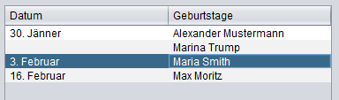

# Geburtstagsverwaltung

## Aufgabe

--- 

s soll eine Swing GUI erstellt werden mit der die Geburtstage von Familie und Freunden verwaltet werden können.

Die Geburtstage sollen in einer Tabelle in dem folgenden Format angezeigt werden:

Mehrere Personen können an dem selben Tag Geburtstag haben.

Über einen Menüpunkt "Geburtstag hinzufügen" soll ein Dialog angezeigt werden, in dem in neuer Geburtstag eingegeben werden kann. Die Person wird in einem Textfeld angegeben und das Datum mit der Komponente [JDateChooser](https://toedter.com/jcalendar/) oder [JDatePicker](https://github.com/JDatePicker/JDatePicker) gewählt.

Wenn in der Tabelle eine Person ausgewählt wurde, soll über einen weiteren Menüpunkt "Geburtstag löschen" diese Person entfernt werden.

Mit einem Menüpunkt "Sprache wechseln" soll die Sprache des Programms gewechselt werden können. Es sollen mindestens drei Sprachen zur Auswahl stehen (Google Translate für die Dritte verwenden). Für die Auswahl soll ein Dialog angezeigt werden. Der Inhalt des Dialogs ist frei wählbar (ComboBox, Buttons,...)

Die eingetragenen Geburtstage sollen beim Beenden des Programms in einer XML Datei gespeichert werden und beim Starten des Programms wieder geladen werden.

## Hinweise

---

[Datumsformatierung](https://www.journaldev.com/17899/java-simpledateformat-java-date-format) unter Java

Achten Sie, dass die korrekte Datumsformatierung der gewählten Sprachen verwendet wird.

## Erweiterung

--- 

Fügen Sie einen Menüpunkt "Drucken" ein mit dem die Geburtstage gedruckt werden können.

Wenn das Programm geladen wurde, sollen in einer Liste neben der Tabelle die Geburtstage des aktuellen Tages angezeigt werden mit einem Label "Heute haben Geburtstag:"